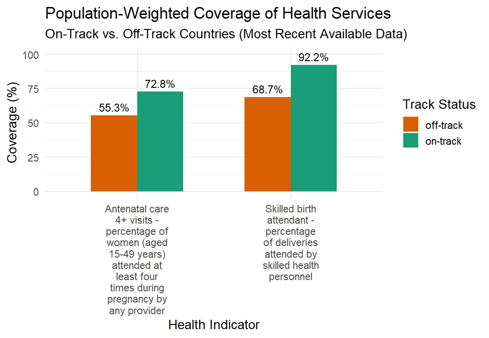

# Administrative Data Analyst – Req. #581696

---

### Assessment Overview

This document outlines the steps followed in conducting the assessment for the position of Administrative Data Analyst – Req. #581696. The analysis was performed using R and involved multiple stages including data preparation, cleaning, wrangling, and visualization.

---

### Data Preparation

The data used in this assessment was sourced from the UNICEF global data repository and included figures for various global geographies. However, the task required a comparative analysis of the **population-weighted averages** for two health indicators, focusing specifically on *off-track* and *on-track* countries.

To tailor the dataset for this purpose:

- I reconciled the UNICEF dataset with the country track status sheet to ensure only countries present in both datasets were included.
- The population data workbook contained two sheets; since the assignment required only **projections for the year 2022**, I retained that sheet and removed the other.
- From the country status sheet, I deleted the country codes column as it was not relevant to the analysis.

---

### Data Cleaning

To streamline the datasets for merging and analysis:

- I retained only the columns essential for the assessment in each workbook.
- I renamed the geographical area columns consistently across all datasets to ensure that “country” served as a common and standardized identifier.

---

### Data Wrangling

To prepare the data for analysis:

- I added a new column to the country status dataset that classified each country as *off-track* or *on-track*, based on the criteria provided in the assignment.
- Using a **left join**, I merged:
  - UNICEF global data on two health indicators,
  - population projections for 2022, and
  - the updated country status dataset.
  
All merges were done using the common country identifier. After merging, I reshaped the combined dataset from wide to long format to facilitate easier analysis.

---

### Data Analysis: Computing Population-Weighted Averages

Population projections in the dataset were represented in thousands. To reflect actual values:

- I created a new column where each figure was multiplied by 1,000.

Many values for the health indicators were missing (NA). To address this:

- I selected the **most recent available non-NA value** for each indicator between **2018 and 2022** for every country.
- These cleaned values were then used to calculate **population-weighted averages** for both off-track and on-track groups.

---

### Visualization

To compare performance across the two groups:

- I created **bar charts** showcasing the differences in two key health indicators:
  - **Percentage of women (aged 15–49) with more than four antenatal visits during pregnancy**.
  - **Percentage of births attended by skilled birth attendants**.

The results revealed:

- On-track countries consistently perform better on both indicators.
- The gap is especially prominent in the percentage of **deliveries attended by skilled birth attendants**.

The bar chart below summarizes these insights:

---

